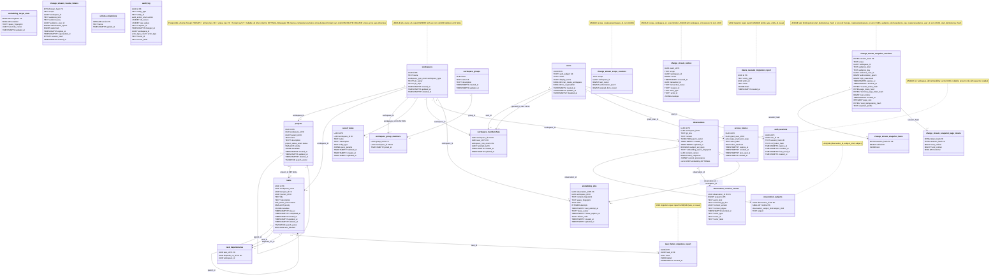

```mermaid
classDiagram
  direction TB
  %% Planning
    class workspaces {
      UUID id PK
      TEXT name
      workspace_type_enum workspace_type
      TEXT? gh_owner
      TEXT? gh_repo
      TIMESTAMPTZ created_at
      TIMESTAMPTZ updated_at
      TIMESTAMPTZ? deleted_at
    }
    class projects {
      UUID id PK
      UUID workspace_id FK
      UUID? parent_id FK
      TEXT name
      TEXT? description
      project_status_enum status
      SMALLINT priority
      JSONB metadata
      TIMESTAMPTZ created_at
      TIMESTAMPTZ updated_at
      TIMESTAMPTZ? deleted_at
      TSVECTOR search_vector
    }
    class tasks {
      UUID id PK
      UUID workspace_id FK
      UUID? project_id FK
      UUID? parent_id FK
      TEXT title
      TEXT? description
      task_status_enum status
      SMALLINT priority
      JSONB metadata
      TIMESTAMPTZ? due_at
      TIMESTAMPTZ? completed_at
      TIMESTAMPTZ created_at
      TIMESTAMPTZ updated_at
      TIMESTAMPTZ? deleted_at
      TSVECTOR search_vector
      BOOLEAN auto_blocked
    }
    class task_dependencies {
      UUID task_id PK FK
      UUID depends_on_id PK FK
      UUID workspace_id
    }
    class workspace_groups {
      UUID id PK
      TEXT name UK
      TEXT? description
      TIMESTAMPTZ created_at
      TIMESTAMPTZ updated_at
    }
    class workspace_group_members {
      UUID group_id PK FK
      UUID workspace_id PK FK
      TIMESTAMPTZ joined_at
    }
    class saved_views {
      UUID id PK
      UUID workspace_id FK
      TEXT name
      TEXT? description
      TEXT entity_type
      JSONB query_params
      TIMESTAMPTZ? deleted_at
      TIMESTAMPTZ created_at
      TIMESTAMPTZ updated_at
    }
  %% Identity
    class users {
      UUID id PK
      TEXT? auth_subject UK
      TEXT? email
      TEXT? display_name
      BOOLEAN can_create_workspace
      BOOLEAN is_superadmin
      TIMESTAMPTZ created_at
      TIMESTAMPTZ updated_at
      TIMESTAMPTZ? disabled_at
    }
    class workspace_memberships {
      UUID workspace_id PK FK
      UUID user_id PK FK
      workspace_role_enum role
      UUID? granted_by FK
      TIMESTAMPTZ created_at
      TIMESTAMPTZ updated_at
    }
    class access_tokens {
      UUID id PK
      UUID grant_user_id FK
      actor_type_enum actor_type
      TEXT actor_label
      TEXT token_hash UK
      TIMESTAMPTZ? expires_at
      TIMESTAMPTZ? revoked_at
      TIMESTAMPTZ? last_used_at
      TIMESTAMPTZ created_at
    }
    class auth_sessions {
      UUID id PK
      UUID user_id FK
      TEXT session_hash UK
      TEXT csrf_token_hash
      TIMESTAMPTZ expires_at
      TIMESTAMPTZ? revoked_at
      TIMESTAMPTZ? last_used_at
      TIMESTAMPTZ created_at
    }
  %% Evidence
    class observations {
      UUID id PK
      UUID workspace_id FK
      TEXT git_sha
      TEXT content
      TSVECTOR search_vector
      TIMESTAMPTZ created_at
      TIMESTAMPTZ updated_at
      BOOLEAN subject_set_open
      TEXT? embedding_space_fingerprint
      UUID content_version
      BIGINT latest_sequence
      JSONB? current_provenance
      vector1536? embedding OPTIONAL
    }
    class observation_subjects {
      UUID observation_id PK FK
      SMALLINT ordinal PK
      observation_subject_kind subject_kind
      TEXT subject
    }
    class observation_revision_events {
      UUID observation_id PK FK
      BIGINT sequence PK
      TEXT event_kind
      TEXT reviewed_git_sha
      UUID? content_version
      TEXT? content_digest
      TIMESTAMPTZ recorded_at
      TEXT? actor_type
      TEXT? actor_id
      TEXT? actor_label
    }
    class embedding_jobs {
      UUID observation_id PK FK
      UUID workspace_id FK
      TEXT content_fingerprint
      TEXT space_fingerprint
      TEXT state
      INTEGER attempts
      TIMESTAMPTZ next_attempt_at
      TEXT? lease_owner
      TIMESTAMPTZ? lease_expires_at
      TEXT? failure_code
      TIMESTAMPTZ created_at
      TIMESTAMPTZ updated_at
    }
    class embedding_target_state {
      BOOLEAN singleton PK
      BOOLEAN enabled
      TEXT? space_fingerprint
      UUID? reconcile_cursor
      TIMESTAMPTZ updated_at
    }
  %% Synchronization
    class change_stream_scope_counters {
      TEXT scope
      UUID? workspace_id
      BIGINT next_cursor
      BIGINT authorization_epoch
      BIGINT retained_from_cursor
    }
    class change_stream_outbox {
      UUID event_id PK
      TEXT scope
      UUID? workspace_id
      BIGINT cursor
      TIMESTAMPTZ occurred_at
      UUID transaction_id
      TEXT transaction_cause
      TEXT? request_id
      TEXT actor_type
      TEXT? actor_id
      JSONB envelope
    }
    class change_stream_resume_tokens {
      BYTEA token_hash PK
      TEXT scope
      UUID? workspace_id
      TEXT audience_kind
      TEXT audience_key
      UUID? audience_user_id
      BIGINT authorization_epoch
      BIGINT watermark
      TIMESTAMPTZ expires_at
      TIMESTAMPTZ? superseded_at
      BYTEA? session_hash
      TIMESTAMPTZ created_at
    }
    class change_stream_snapshot_sessions {
      BYTEA session_hash PK
      TEXT scope
      UUID? workspace_id
      TEXT audience_kind
      TEXT audience_key
      UUID? audience_user_id
      BIGINT authorization_epoch
      BIGINT high_watermark
      TIMESTAMPTZ expires_at
      TIMESTAMPTZ? terminal_at
      BYTEA? resume_token_hash
      BYTEA page_token_hash
      BYTEA? terminal_page_token_hash
      BIGINT next_ordinal
      TIMESTAMPTZ created_at
      INTEGER? page_size
      BYTEA? start_idempotency_hash
      TEXT snapshot_profile
    }
    class change_stream_snapshot_items {
      BYTEA session_hash PK FK
      BIGINT ordinal PK
      JSONB item
    }
    class change_stream_snapshot_page_tokens {
      BYTEA token_hash PK
      BYTEA session_hash FK
      BIGINT start_ordinal
      BIGINT? end_ordinal
      BOOLEAN terminal
    }
  %% Administration
    class schema_migrations {
      INTEGER version PK
      TEXT name
      TIMESTAMPTZ applied_at
    }
    class audit_log {
      UUID id PK
      TEXT entity_type
      TEXT entity_id
      audit_action_enum action
      JSONB? old_values
      JSONB? new_values
      TEXT? request_id
      TIMESTAMPTZ changed_at
      UUID? workspace_id
      actor_type_enum? actor_type
      TEXT? actor_id
      TEXT? actor_label
    }
    class task_flatten_migration_report {
      UUID id PK
      UUID? task_id FK
      TEXT issue
      JSONB detail
      TIMESTAMPTZ created_at
    }
    class delete_cascade_migration_report {
      UUID id PK
      TEXT entity_type
      UUID entity_id
      TEXT issue
      JSONB detail
      TIMESTAMPTZ created_at
    }

  workspaces "1" --> "0..*" projects : workspace_id
  projects "0..1" --> "0..*" projects : parent_id
  workspaces "1" --> "0..*" tasks : workspace_id
  projects "0..1" --> "0..*" tasks : project_id SET NULL
  tasks "0..1" --> "0..*" tasks : parent_id
  tasks "1" --> "0..*" task_dependencies : task_id
  tasks "1" --> "0..*" task_dependencies : depends_on_id
  workspace_groups "1" --> "0..*" workspace_group_members : group_id
  workspaces "1" --> "0..*" workspace_group_members : workspace_id
  workspaces "1" --> "0..*" saved_views : workspace_id NO ACTION
  workspaces "1" --> "0..*" workspace_memberships : workspace_id
  users "1" --> "0..*" workspace_memberships : user_id
  users "0..1" --> "0..*" workspace_memberships : granted_by SET NULL
  users "1" --> "0..*" access_tokens : grant_user_id
  users "1" --> "0..*" auth_sessions : user_id
  workspaces "1" --> "0..*" observations : workspace_id
  observations "1" --> "0..*" observation_subjects : observation_id
  observations "1" --> "0..*" observation_revision_events : observation_id
  observations "1" --> "0..1" embedding_jobs : observation_id + workspace_id
  workspaces "1" --> "0..*" embedding_jobs : workspace_id
  change_stream_snapshot_sessions "1" --> "0..*" change_stream_snapshot_items : session_hash
  change_stream_snapshot_sessions "1" --> "0..*" change_stream_snapshot_page_tokens : session_hash
  tasks "0..1" --> "0..*" task_flatten_migration_report : task_id

  note "PostgreSQL schema through V033\nPK = primary key; UK = unique key; FK = foreign key\n? = nullable; all other columns NOT NULL\nRepeated PK marks a composite key\nLines show declared foreign keys only\nON DELETE CASCADE unless a line says otherwise"
  note for workspaces "UNIQUE (gh_owner, gh_repo)\nWHERE both are non-null AND deleted_at IS NULL"
  note for observations "UNIQUE (id, workspace_id)\nembedding: vector(1536), nullable; present only with pgvector enabled"
  note for observation_subjects "UNIQUE (observation_id, subject_kind, subject)"
  note for change_stream_scope_counters "UNIQUE (scope, coalesce(workspace_id, zero UUID))"
  note for change_stream_outbox "UNIQUE (scope, workspace_id, cursor)\nAlso UNIQUE with workspace_id coalesced to zero UUID"
  note for change_stream_snapshot_sessions "UNIQUE start binding when start_idempotency_hash is non-null:\nscope, coalesce(workspace_id, zero UUID), audience_kind,\naudience_key, coalesce(audience_user_id, zero UUID), start_idempotency_hash"
  note for task_flatten_migration_report "V018 migration repair report\nUNIQUE (task_id, issue)"
  note for delete_cascade_migration_report "V019 migration repair report\nUNIQUE (entity_type, entity_id, issue)"
```
